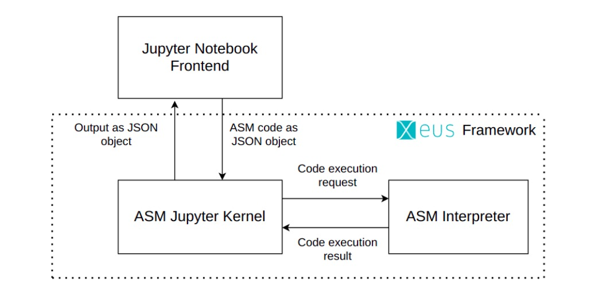

# Jupyter Kernel for ASM

This repository is for the final year term project where we aim to create a **Jupyter Kernel** for 8085 Microprocessor assembly language. Our project aims to develop a kernel that can interpret assembly-level programs right from Jupyter notebook.

## Project Supervisor

- [Dr. Philemon Daniel](https://github.com/phildani7)

## Team Members

- [Sarita Singh](https://github.com/itssingh)
- [Tamanna Rana](https://github.com/TamannaRana123)
- [B. Krutik Ganpati](https://github.com/13KFossil)
- [Nikita Mahoviya](https://github.com/nikitamahoviya)

## Organization

[National Institute of Technology Hamirpur](https://nith.ac.in/)

## Motivation

In our previous semesters, we went through courses dealing with 8085 microprocessor and 8086 microcontroller which required coding over software like, GNUSim8085 and arm Keil respectively. While accessing these softwares we encountered certain problems listed below::
- Compatibility issues with the different operating systems  
- License required which can be either institutional or bought.
- Software size producing memory issues. 

These issues made us brainstorm in a direction that could increase the ease of user experience and you won’t be needing your system always for any sort of work as everything will be browser-based and you will be just a login away from your work.
## Workflow

